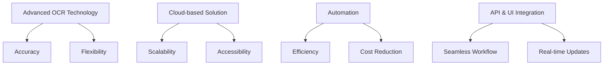
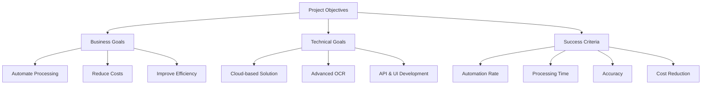
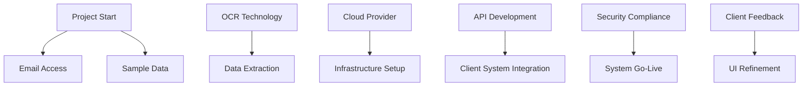
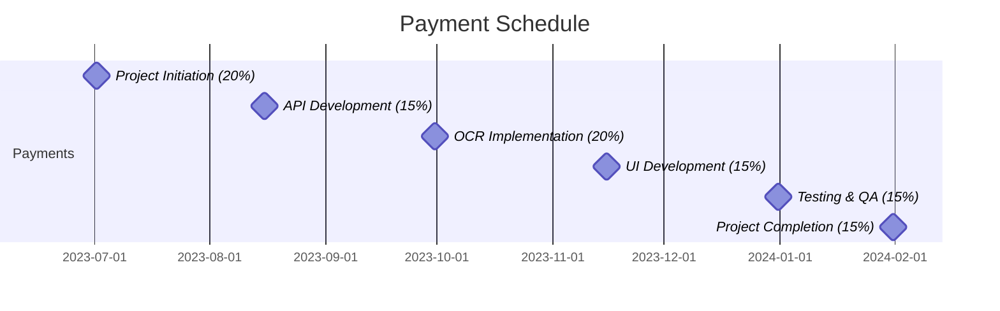
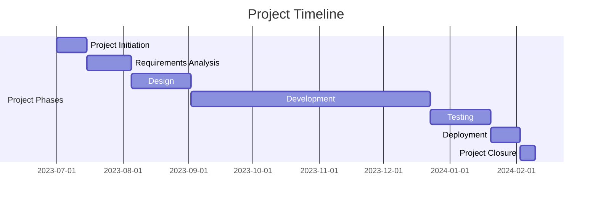
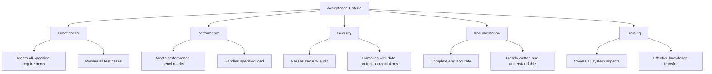

## EXECUTIVE SUMMARY

### PROJECT OVERVIEW

Dollar Funding, a Merchant Cash Advance (MCA) provider, seeks to automate their application processing workflow. Currently relying on a 30-person data entry team, they aim to digitize and streamline the process of handling MCA applications received via email. The proposed cloud-based solution will automate the extraction, classification, and storage of application data from PDF attachments, significantly reducing manual labor and improving efficiency.

### OBJECTIVES

1. Automate email processing and data extraction from PDF attachments
2. Implement advanced OCR technology to handle various application formats
3. Develop a secure database for storing extracted information
4. Create an API and user interface for client interaction
5. Implement webhook notifications for real-time updates
6. Reduce manual data entry workforce by 93% (from 30 to 2 employees)

### VALUE PROPOSITION

Our agency offers a comprehensive, cutting-edge solution that addresses Dollar Funding's specific needs:

1. State-of-the-art OCR technology capable of processing imperfect and handwritten applications
2. Scalable cloud-based architecture ensuring high availability and performance
3. Seamless integration with existing systems through robust API and intuitive UI
4. Significant cost savings through automation, reducing manual workforce by 93%
5. Enhanced data security and compliance with industry standards
6. Real-time processing updates via webhook notifications
7. Customizable solution tailored to Dollar Funding's unique workflow requirements

## PROJECT OBJECTIVES

### BUSINESS GOALS

1. Automate MCA application processing to significantly reduce manual labor
2. Increase operational efficiency by streamlining the application handling workflow
3. Reduce operational costs by downsizing the data entry team from 30 to 2 employees
4. Improve accuracy and consistency in application data extraction and classification
5. Enhance scalability to handle growing application volumes without proportional increase in resources
6. Accelerate application processing time to improve customer satisfaction and potentially increase business volume

### TECHNICAL GOALS

1. Develop a cloud-based solution with high availability and scalability
2. Implement advanced OCR technology capable of processing imperfect and handwritten applications
3. Create a secure database for storing extracted application information and email metadata
4. Develop a robust API for seamless integration with existing systems
5. Design an intuitive user interface for easy access to application information and system management
6. Implement webhook functionality for real-time notifications and updates
7. Ensure compliance with data security standards and regulations

### SUCCESS CRITERIA

| Criterion | Target | Measurement Method |
|-----------|--------|---------------------|
| Automation Rate | 95% of applications processed without manual intervention | Percentage of applications successfully processed automatically |
| Processing Time | Reduce average processing time by 80% | Compare average processing time before and after implementation |
| Accuracy | 99% accuracy in data extraction and classification | Random sample audits and error rate tracking |
| Cost Reduction | 93% reduction in data entry team (from 30 to 2 employees) | Headcount comparison pre- and post-implementation |
| System Uptime | 99.9% availability | Monitoring system uptime and downtime incidents |
| API Response Time | 95% of API requests completed within 500ms | API performance monitoring and logging |
| User Satisfaction | 90% positive feedback from internal users | User surveys and feedback collection |
| Scalability | System capable of handling 200% increase in application volume without performance degradation | Load testing and performance benchmarking |

## SCOPE OF WORK

### IN-SCOPE

1. Email Processing and Data Extraction
   - Automated retrieval of emails from submissions@dollarfunding.com
   - Extraction and storage of email metadata (sender, body, subject, etc.)
   - Extraction and classification of PDF attachments (ISO application, bank statements, voided cheques)

2. Advanced OCR Implementation
   - Development of a specialized OCR solution capable of processing:
     - Imperfect scans
     - Hand-written applications
   - Extraction of key information from ISO applications:
     - Merchant details (Business legal name, DBA name, Federal Tax ID/EIN, Address, Industry, Revenue)
     - Funding details (Funding requested, use of funds)
     - Owner information (Name, SSN, Address, Date of Birth, ownership percentage)

3. Database Development
   - Design and implementation of a secure database to store:
     - Email metadata
     - Extracted application information
     - Application processing status (Processing, Ready, Failed)

4. Cloud Storage Solution
   - Implementation of a secure cloud storage bucket for PDF attachments
   - Development of secure access mechanisms for client retrieval

5. API Development
   - Creation of RESTful API endpoints for:
     - Retrieving application information
     - Downloading application attachments
     - Registering, editing, and viewing webhooks

6. User Interface Development
   - Design and implementation of a web-based UI for:
     - Displaying application information and attachments
     - Managing webhooks (view, add, remove)

7. Webhook Notification System
   - Implementation of a webhook system to notify clients of:
     - Successful application processing
     - Applications requiring review (processing failures, missing SSN/Federal Tax ID)

8. Security and Compliance
   - Implementation of industry-standard security measures
   - Ensuring compliance with relevant data protection regulations

9. Scalability and High Availability
   - Design and implementation of a cloud-based architecture ensuring:
     - Scalability to handle increased application volumes
     - High availability (99.9% uptime)

10. Documentation and Training
    - Creation of comprehensive system documentation
    - Development of training materials for client's remaining data entry team

### OUT-OF-SCOPE

1. Physical hardware procurement or setup at client's location
2. Integration with client's internal systems beyond the specified API and webhook functionalities
3. Manual data entry or correction of extracted information
4. Processing of non-PDF file formats
5. Development of mobile applications
6. Handling of emails received at addresses other than submissions@dollarfunding.com
7. Automated decision-making or approval processes for MCA applications
8. Long-term data storage or archiving solutions beyond the immediate needs of the system
9. Customer support for end-users (MCA applicants)

### ASSUMPTIONS

1. Dollar Funding will provide timely access to the submissions@dollarfunding.com email account
2. The client will make available sample sets of typical applications and edge cases for testing
3. Dollar Funding will provide necessary information about their current workflow and data requirements
4. The client has the necessary infrastructure to consume API endpoints and receive webhook notifications
5. The volume of applications will not exceed 200% of current levels during the initial implementation phase
6. Dollar Funding will handle any necessary communications with their brokers regarding the new system
7. The client will be responsible for any required changes to their internal processes to accommodate the new system
8. Necessary third-party services (e.g., cloud providers, OCR technology) will remain available and stable

### DEPENDENCIES

1. Email Access: Timely provision of access to the submissions@dollarfunding.com email account
2. Sample Data: Availability of a comprehensive set of sample applications for development and testing
3. OCR Technology: Selection and licensing of appropriate OCR software or services
4. Cloud Provider: Selection and setup of cloud infrastructure (e.g., AWS, Azure, Google Cloud)
5. API Development: Completion of API endpoints before client system integration can begin
6. Security Compliance: Verification of compliance with relevant data protection regulations
7. Client Feedback: Timely review and feedback from Dollar Funding on UI and functionality
8. Third-party Services: Availability and stability of required third-party services and APIs

## BUDGET AND COST ESTIMATES

### COST BREAKDOWN

| Category | Description | Cost (USD) |
|----------|-------------|------------|
| Labor | Development Team (1,920 hours @ $150/hr) | $288,000 |
| | Project Management (480 hours @ $175/hr) | $84,000 |
| | Quality Assurance (320 hours @ $125/hr) | $40,000 |
| | UI/UX Design (160 hours @ $140/hr) | $22,400 |
| Infrastructure | Cloud Services (AWS) - Annual Estimate | $60,000 |
| | OCR Technology Licensing - Annual | $30,000 |
| Software | Development Tools and Licenses | $10,000 |
| Security | Security Audit and Compliance | $25,000 |
| Training | Documentation and Training Materials | $15,000 |
| Contingency | 10% of total budget | $57,440 |
| **Total** | | **$631,840** |

### PAYMENT SCHEDULE

1. Project Initiation (20%): $126,368 - Due upon contract signing
2. API Development Completion (15%): $94,776 - Due upon successful API implementation
3. OCR Implementation (20%): $126,368 - Due upon completion of OCR integration
4. UI Development (15%): $94,776 - Due upon completion of user interface
5. Testing & QA (15%): $94,776 - Due upon successful completion of testing phase
6. Project Completion (15%): $94,776 - Due upon final delivery and client acceptance

### BUDGET CONSIDERATIONS

1. OCR Technology Performance:
   - Risk: The performance of the OCR technology may require additional fine-tuning or a switch to a more advanced solution.
   - Mitigation: We have allocated a substantial budget for OCR licensing and included contingency funds. If needed, we can reallocate resources or extend the development timeline to ensure optimal performance.

2. Cloud Infrastructure Costs:
   - Risk: Actual usage may exceed or fall below the estimated annual cloud services cost.
   - Mitigation: We will implement cloud cost monitoring tools and provide monthly reports to the client. The contract will include provisions for adjusting the ongoing cloud services budget based on actual usage.

3. Scope Creep:
   - Risk: Additional features or requirements may be identified during development, potentially impacting the budget.
   - Mitigation: We have included a 10% contingency fund. Any significant changes to the scope will be addressed through a formal change request process, with associated costs clearly communicated to the client.

4. Integration Challenges:
   - Risk: Unforeseen difficulties in integrating with Dollar Funding's existing systems could increase development time and costs.
   - Mitigation: We have allocated ample time for API development and testing. If major integration issues arise, we will work closely with Dollar Funding's IT team to resolve them, potentially using part of the contingency budget if necessary.

5. Security and Compliance:
   - Risk: Changes in data protection regulations or additional security requirements could impact the project timeline and budget.
   - Mitigation: We have included a dedicated budget for security audits and compliance. Our team will stay informed about relevant regulations and adapt our approach as needed, using the contingency fund if required.

6. Exchange Rate Fluctuations:
   - Risk: If any project components involve international vendors or services, exchange rate changes could affect costs.
   - Mitigation: Where applicable, we will use forward contracts or include provisions in the client contract to address potential currency fluctuations.

7. Staffing Changes:
   - Risk: Unexpected changes in key personnel could impact project timelines and potentially the budget.
   - Mitigation: Our agency maintains a deep bench of skilled professionals. We have included knowledge transfer processes in our project management approach to minimize the impact of any staffing changes.

By carefully considering these budget factors and implementing the proposed mitigation strategies, we aim to deliver the project within the estimated budget while maintaining flexibility to address unforeseen challenges.

## TIMELINE AND MILESTONES

### PROJECT TIMELINE

### KEY MILESTONES

| Milestone | Description | Target Date |
|-----------|-------------|-------------|
| M1: Project Kickoff | Project initiation and team onboarding | 2023-07-01 |
| M2: Requirements Approval | Client sign-off on detailed requirements | 2023-08-04 |
| M3: Design Completion | Approval of system architecture and UI/UX designs | 2023-09-01 |
| M4: API Development | Completion of core API functionality | 2023-10-13 |
| M5: OCR Integration | Implementation of advanced OCR solution | 2023-11-10 |
| M6: UI Development | Completion of user interface | 2023-12-08 |
| M7: Testing Completion | Successful completion of all testing phases | 2024-01-19 |
| M8: System Deployment | Go-live and system handover to client | 2024-02-02 |
| M9: Project Closure | Final documentation and project sign-off | 2024-02-09 |

### CRITICAL PATH

The following tasks represent the critical path for the project:

1. Requirements Analysis and Approval (5 weeks)
   - Detailed analysis of client's current workflow
   - Documentation of system requirements
   - Client review and sign-off

2. System Architecture Design (3 weeks)
   - Cloud infrastructure design
   - Database schema design
   - API structure planning

3. Core API Development (6 weeks)
   - Implementation of email processing functionality
   - Development of data extraction and storage features
   - Integration with cloud storage for PDF attachments

4. OCR Integration (4 weeks)
   - Implementation of advanced OCR solution
   - Fine-tuning for handling imperfect and handwritten applications
   - Integration with core API

5. UI Development (4 weeks)
   - Implementation of web-based user interface
   - Development of application viewing and webhook management features

6. System Integration and Testing (4 weeks)
   - Integration of all system components
   - Comprehensive testing (unit, integration, system, user acceptance)
   - Performance and security testing

7. Deployment and Go-Live (2 weeks)
   - System deployment to production environment
   - Final data migration and system configuration
   - Go-live and initial monitoring

Adherence to this critical path is essential for maintaining the project schedule. Any delays in these tasks could potentially impact the overall project timeline. Regular monitoring and proactive management of these critical activities will be crucial for ensuring timely project completion.

## DELIVERABLES

### LIST OF DELIVERABLES

1. Cloud-Based Application Processing System
   - Email Processing Module
   - Advanced OCR Engine
   - Data Extraction and Classification Module
   - Secure Database
   - Cloud Storage Solution
   - RESTful API
   - Web-based User Interface
   - Webhook Notification System

2. Documentation
   - System Architecture Documentation
   - API Documentation
   - User Manual
   - Administrator Guide
   - Security and Compliance Documentation

3. Training Materials
   - User Training Guide
   - Video Tutorials
   - Administrator Training Manual

4. Source Code and Deployment Package
   - Fully commented source code
   - Deployment scripts and configuration files

5. Testing and Quality Assurance
   - Test Plans and Test Cases
   - QA Reports
   - Performance Benchmark Results

### DELIVERY SCHEDULE

| Deliverable | Expected Delivery Date |
|-------------|------------------------|
| System Architecture Documentation | 2023-09-01 |
| Email Processing Module | 2023-09-29 |
| Advanced OCR Engine | 2023-11-10 |
| Data Extraction and Classification Module | 2023-11-24 |
| Secure Database | 2023-10-13 |
| Cloud Storage Solution | 2023-10-27 |
| RESTful API | 2023-11-17 |
| Web-based User Interface | 2023-12-08 |
| Webhook Notification System | 2023-12-15 |
| API Documentation | 2023-12-22 |
| User Manual | 2024-01-05 |
| Administrator Guide | 2024-01-05 |
| Security and Compliance Documentation | 2024-01-12 |
| Training Materials | 2024-01-19 |
| Source Code and Deployment Package | 2024-01-26 |
| Test Plans, Cases, and QA Reports | 2024-01-19 |
| Performance Benchmark Results | 2024-01-26 |

### ACCEPTANCE CRITERIA

1. Cloud-Based Application Processing System
   - Successfully processes 95% of applications without manual intervention
   - Accurately extracts and classifies data from ISO applications, bank statements, and voided cheques
   - OCR engine handles imperfect scans and handwritten applications with 99% accuracy
   - API endpoints respond within 500ms for 95% of requests under normal load
   - Web UI is responsive and functions correctly across major browsers (Chrome, Firefox, Safari, Edge)
   - Webhook system delivers notifications reliably and in real-time

2. Documentation
   - Comprehensive coverage of all system components and functionalities
   - Clear, concise, and free of technical errors
   - Includes all necessary diagrams, flowcharts, and examples
   - Passes review by technical writing team and client representatives

3. Training Materials
   - Covers all aspects of system usage for both users and administrators
   - Includes hands-on exercises and real-world scenarios
   - Video tutorials are clear, concise, and professionally produced
   - Successfully facilitates knowledge transfer to client's team (validated through post-training assessment)

4. Source Code and Deployment Package
   - Code adheres to agreed-upon coding standards and best practices
   - Successfully builds and deploys in test environment without errors
   - Includes comprehensive inline comments and documentation
   - Passes code review by senior developers

5. Testing and Quality Assurance
   - System passes all defined test cases (unit, integration, system, and user acceptance tests)
   - Performance tests demonstrate system can handle 200% of current application volume without degradation
   - Security testing reveals no critical or high-priority vulnerabilities
   - QA reports are comprehensive and demonstrate thorough testing coverage

Final acceptance of all deliverables will be subject to client review and sign-off. Any issues or discrepancies identified during the review process will be addressed and resolved before final acceptance is granted.