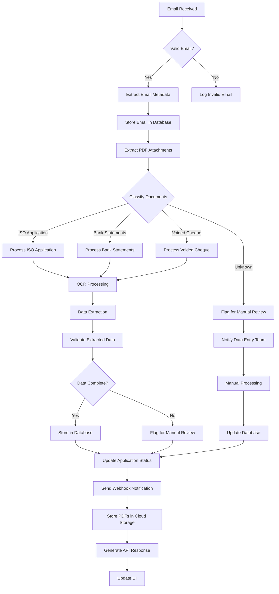
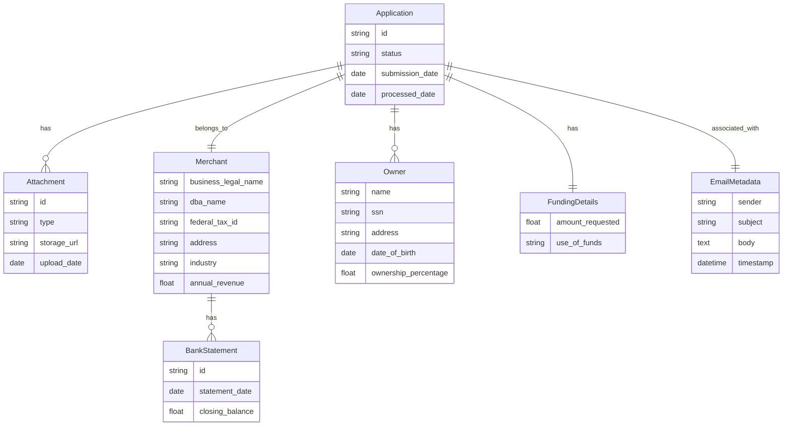
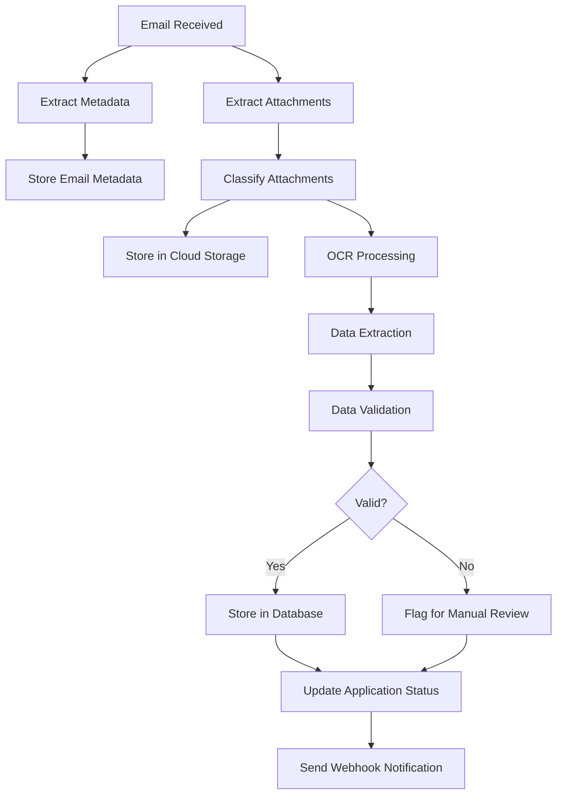

## INTRODUCTION

### PURPOSE

This Software Requirements Specification (SRS) document aims to provide a comprehensive and detailed description of the cloud-based Merchant Cash Advance (MCA) application processing system for Dollar Funding. The purpose of this document is to:

1. Define the functional and non-functional requirements of the system
2. Establish a clear understanding of the project scope and objectives
3. Serve as a reference for stakeholders throughout the development process
4. Provide a basis for project planning, estimation, and quality assurance

The intended audience for this SRS includes:

- Dollar Funding management and stakeholders
- Development team members (software engineers, designers, and quality assurance specialists)
- Project managers and technical leads
- System administrators and maintenance personnel
- Potential future maintainers or developers of the system

### SCOPE

The cloud-based MCA application processing system is designed to automate and streamline Dollar Funding's current manual process for handling Merchant Cash Advance applications. This system will significantly reduce the need for manual data entry, improve processing efficiency, and enhance data accuracy.

High-level overview of the software product:

1. Goals:
   - Automate the processing of MCA applications received via email
   - Reduce manual data entry workforce by 93% (from 30 to 2 employees)
   - Improve application processing speed and accuracy
   - Provide a scalable and highly available solution

2. Benefits:
   - Significant reduction in operational costs
   - Increased processing capacity without proportional increase in resources
   - Improved data accuracy and consistency
   - Enhanced security and compliance with data protection regulations
   - Real-time application status updates and notifications

3. Core Functionalities:
   a. Email Processing:
      - Automated retrieval and processing of emails from submissions@dollarfunding.com
      - Extraction and storage of email metadata

   b. Document Processing:
      - Advanced OCR technology for extracting information from PDF attachments
      - Classification of documents (ISO application, bank statements, voided cheques)
      - Handling of imperfect scans and handwritten applications

   c. Data Extraction and Storage:
      - Extraction of key information from ISO applications (merchant details, funding details, owner information)
      - Secure storage of extracted data in a cloud-based database

   d. Cloud Storage:
      - Secure storage of PDF attachments in a cloud storage bucket
      - Controlled access for client retrieval

   e. API and User Interface:
      - RESTful API for programmatic access to application data and system functions
      - Web-based user interface for viewing applications and managing system settings

   f. Notification System:
      - Webhook-based notifications for application status updates
      - Alerts for applications requiring manual review

   g. Security and Compliance:
      - Implementation of industry-standard security measures
      - Compliance with relevant data protection regulations

The system will be built using the following technology stack:

- Backend: Python
- Frontend: TypeScript, React, and Tailwind CSS
- Cloud Infrastructure: Google Cloud Platform (GCP)

This comprehensive solution will enable Dollar Funding to process MCA applications more efficiently, reduce operational costs, and scale their business operations effectively.

## PRODUCT DESCRIPTION

### PRODUCT PERSPECTIVE

The cloud-based Merchant Cash Advance (MCA) application processing system is a standalone solution designed to integrate seamlessly with Dollar Funding's existing infrastructure. It operates within the following context:

```mermaid
graph TD
    A[Dollar Funding Ecosystem] --> B[MCA Application Processing System]
    B --> C[Email Server]
    B --> D[Cloud Storage]
    B --> E[Database]
    B --> F[Client Systems]
    B --> G[Third-party Services]
    C --> H[submissions@dollarfunding.com]
    D --> I[Google Cloud Storage]
    E --> J[Google Cloud SQL]
    F --> K[API Integration]
    F --> L[Webhook Notifications]
    G --> M[OCR Service]
```

1. Email Integration: The system interfaces with Dollar Funding's email server to access and process emails sent to submissions@dollarfunding.com.

2. Cloud Infrastructure: Utilizes Google Cloud Platform (GCP) for hosting, storage, and database services, ensuring scalability and reliability.

3. Client Integration: Provides RESTful API endpoints and webhook notifications for seamless integration with Dollar Funding's existing systems.

4. Third-party Services: Integrates with advanced OCR services to process application documents accurately.

5. User Interface: Offers a web-based interface built with React and Tailwind CSS, accessible to authorized Dollar Funding personnel.

6. Security Layer: Implements industry-standard security measures to protect sensitive financial data throughout the processing pipeline.

### PRODUCT FUNCTIONS

The MCA application processing system will perform the following high-level functions:

1. Email Processing:
   - Automatically retrieve and parse emails from submissions@dollarfunding.com
   - Extract and store email metadata (sender, subject, body, timestamp)

2. Document Handling:
   - Extract PDF attachments from emails
   - Classify documents (ISO application, bank statements, voided cheques)
   - Store documents securely in Google Cloud Storage

3. Data Extraction:
   - Utilize advanced OCR technology to extract text from PDF documents
   - Parse and categorize extracted information (merchant details, funding details, owner information)
   - Handle imperfect scans and handwritten applications

4. Data Storage:
   - Store extracted application data in a secure Google Cloud SQL database
   - Maintain application status (Processing, Ready, Failed)

5. API Services:
   - Provide RESTful API endpoints for:
     - Retrieving application data
     - Downloading application documents
     - Managing webhook subscriptions

6. User Interface:
   - Display application information and status
   - Allow viewing and downloading of application documents
   - Provide webhook management interface

7. Notification System:
   - Send real-time webhook notifications for application status updates
   - Alert for applications requiring manual review

8. Security and Compliance:
   - Implement encryption for data at rest and in transit
   - Ensure compliance with relevant data protection regulations

9. Reporting and Analytics:
   - Generate processing statistics and performance metrics
   - Provide insights on application trends and processing efficiency

### USER CHARACTERISTICS

The system is designed for use by the following user groups:

1. Data Entry Specialists:
   - Expertise: Moderate technical skills, familiar with MCA application processing
   - Responsibilities: Review and manage processed applications, handle exceptions
   - Persona: Sarah, 35, has 5 years of experience in data entry and basic troubleshooting

2. System Administrators:
   - Expertise: High technical skills, experienced in cloud infrastructure and API management
   - Responsibilities: Manage system configuration, monitor performance, handle integrations
   - Persona: Alex, 40, IT professional with 10+ years of experience in financial software systems

3. Management Team:
   - Expertise: Limited technical skills, high business acumen
   - Responsibilities: Access reports, monitor overall system performance and efficiency
   - Persona: Michael, 45, Operations Manager with 15 years in the MCA industry

4. API Consumers:
   - Expertise: High technical skills, experienced in API integration
   - Responsibilities: Integrate Dollar Funding's systems with the MCA processing API
   - Persona: Emma, 32, Senior Software Engineer specializing in financial integrations

### CONSTRAINTS

1. Regulatory Compliance:
   - Must adhere to financial data protection regulations (e.g., GDPR, CCPA)
   - Compliance with industry-specific regulations for MCA providers

2. Technical Limitations:
   - Integration limited to email submissions from submissions@dollarfunding.com
   - OCR accuracy dependent on the quality of submitted documents

3. Performance Requirements:
   - System must handle a 200% increase in current application volume without degradation
   - API response times must not exceed 500ms for 95% of requests

4. Security Constraints:
   - All data must be encrypted at rest and in transit
   - Strict access controls and audit logging required

5. Budgetary Constraints:
   - Development and implementation costs not to exceed $631,840
   - Ongoing operational costs must align with projected 93% reduction in manual workforce

6. Time Constraints:
   - System must be fully operational within 7 months from project initiation

7. User Interface Constraints:
   - UI must be web-based and compatible with major browsers (Chrome, Firefox, Safari, Edge)
   - Must be accessible and usable on both desktop and tablet devices

### ASSUMPTIONS AND DEPENDENCIES

Assumptions:

1. Dollar Funding will provide timely access to the submissions@dollarfunding.com email account
2. The volume and format of incoming applications will remain consistent with current patterns
3. Dollar Funding's existing IT infrastructure can support API integrations and webhook notifications
4. The client will handle any necessary communications with brokers regarding the new system
5. The remaining data entry team (2 employees) will be capable of managing exceptions and manual reviews

Dependencies:

1. Availability and performance of Google Cloud Platform services
2. Reliability and accuracy of the chosen OCR technology
3. Timely provision of sample data and test cases by Dollar Funding
4. Stability of third-party APIs and services integrated into the system
5. Availability of Dollar Funding's IT team for integration support and testing
6. Timely feedback and approvals from Dollar Funding stakeholders at key project milestones
7. Continued validity of current data protection regulations and compliance requirements

## PROCESS FLOWCHART

The following flowchart illustrates the high-level process flow of the cloud-based Merchant Cash Advance (MCA) application processing system:



This flowchart outlines the main steps in the MCA application processing system:

1. Email Reception and Validation
2. Email Metadata Extraction and Storage
3. PDF Attachment Extraction
4. Document Classification
5. OCR Processing and Data Extraction
6. Data Validation and Storage
7. Application Status Updates
8. Webhook Notifications
9. Cloud Storage of PDFs
10. API Response Generation
11. UI Updates
12. Manual Processing for Flagged Applications

The system is designed to handle the majority of applications automatically, with provisions for manual intervention when necessary. It leverages Python for backend processing, including email handling, OCR, and data extraction. The user interface updates are managed using React and Tailwind CSS, ensuring a responsive and modern front-end experience.

This process flow ensures efficient handling of MCA applications, from initial email reception to final data storage and notification, aligning with Dollar Funding's goal of automating their application processing workflow.

Here's a breakdown of the product features with the requested sub-sections:

1. Email Processing and Metadata Extraction

ID: F001
DESCRIPTION: Automatically retrieve and process emails from submissions@dollarfunding.com, extracting and storing email metadata.
PRIORITY: High

| Requirement ID | Requirement Description |
|----------------|--------------------------|
| F001-1 | Retrieve emails from submissions@dollarfunding.com using IMAP or POP3 protocol |
| F001-2 | Extract email metadata (sender, subject, body, timestamp) |
| F001-3 | Store email metadata in Google Cloud SQL database |
| F001-4 | Update application status (Processing, Ready, Failed) in the database |
| F001-5 | Handle email attachments and prepare them for further processing |

2. Document Classification and Storage

ID: F002
DESCRIPTION: Classify PDF attachments and store them securely in Google Cloud Storage.
PRIORITY: High

| Requirement ID | Requirement Description |
|----------------|--------------------------|
| F002-1 | Classify PDF attachments (ISO application, bank statements, voided cheques) |
| F002-2 | Store classified PDFs in Google Cloud Storage bucket |
| F002-3 | Generate secure, time-limited access URLs for client retrieval |
| F002-4 | Implement versioning and backup for stored documents |
| F002-5 | Ensure compliance with data protection regulations for document storage |

3. Advanced OCR and Data Extraction

ID: F003
DESCRIPTION: Implement state-of-the-art OCR technology to extract text from PDFs, including imperfect scans and handwritten applications.
PRIORITY: Critical

| Requirement ID | Requirement Description |
|----------------|--------------------------|
| F003-1 | Integrate advanced OCR engine capable of processing imperfect scans |
| F003-2 | Implement handwriting recognition for handwritten applications |
| F003-3 | Extract merchant details (Business name, DBA, Tax ID, Address, Industry, Revenue) |
| F003-4 | Extract funding details (Amount requested, use of funds) |
| F003-5 | Extract owner information (Name, SSN, Address, DOB, ownership percentage) |

4. Data Storage and Management

ID: F004
DESCRIPTION: Design and implement a secure database to store extracted application data and maintain application status.
PRIORITY: High

| Requirement ID | Requirement Description |
|----------------|--------------------------|
| F004-1 | Design and implement database schema in Google Cloud SQL |
| F004-2 | Store extracted application data securely |
| F004-3 | Implement data encryption at rest and in transit |
| F004-4 | Create indexes for efficient data retrieval |
| F004-5 | Implement data retention and archiving policies |

5. RESTful API Development

ID: F005
DESCRIPTION: Develop a comprehensive API for accessing application data and system functions.
PRIORITY: High

| Requirement ID | Requirement Description |
|----------------|--------------------------|
| F005-1 | Implement RESTful API endpoints for retrieving application data |
| F005-2 | Create endpoints for downloading application documents |
| F005-3 | Develop endpoints for managing webhook subscriptions |
| F005-4 | Implement API authentication and authorization |
| F005-5 | Generate comprehensive API documentation |

6. Web-based User Interface

ID: F006
DESCRIPTION: Develop a responsive web-based UI for viewing applications and managing system settings.
PRIORITY: Medium

| Requirement ID | Requirement Description |
|----------------|--------------------------|
| F006-1 | Create a dashboard for viewing application information and status |
| F006-2 | Implement document viewer for application attachments |
| F006-3 | Develop interface for managing webhook subscriptions |
| F006-4 | Implement user authentication and role-based access control |
| F006-5 | Ensure responsive design using React and Tailwind CSS |

7. Webhook Notification System

ID: F007
DESCRIPTION: Implement a webhook-based notification system for real-time updates on application status.
PRIORITY: Medium

| Requirement ID | Requirement Description |
|----------------|--------------------------|
| F007-1 | Develop webhook registration and management system |
| F007-2 | Implement real-time notifications for application status updates |
| F007-3 | Create alerts for applications requiring manual review |
| F007-4 | Implement retry mechanism for failed webhook deliveries |
| F007-5 | Provide webhook testing and debugging tools |

8. Security and Compliance

ID: F008
DESCRIPTION: Implement comprehensive security measures and ensure compliance with relevant data protection regulations.
PRIORITY: Critical

| Requirement ID | Requirement Description |
|----------------|--------------------------|
| F008-1 | Implement end-to-end encryption for data in transit |
| F008-2 | Ensure compliance with GDPR, CCPA, and other relevant regulations |
| F008-3 | Implement robust access control and user authentication |
| F008-4 | Conduct regular security audits and penetration testing |
| F008-5 | Implement comprehensive logging and monitoring |

9. Scalability and Performance Optimization

ID: F009
DESCRIPTION: Ensure the system is scalable and optimized to handle increased application volumes.
PRIORITY: High

| Requirement ID | Requirement Description |
|----------------|--------------------------|
| F009-1 | Implement auto-scaling for application servers using Google Kubernetes Engine |
| F009-2 | Optimize database queries and implement caching where appropriate |
| F009-3 | Implement load balancing for even distribution of traffic |
| F009-4 | Conduct performance testing to ensure system can handle 200% increase in volume |
| F009-5 | Implement monitoring and alerting for performance metrics |

10. Reporting and Analytics

ID: F010
DESCRIPTION: Develop reporting and analytics features to provide insights on application processing and system performance.
PRIORITY: Low

| Requirement ID | Requirement Description |
|----------------|--------------------------|
| F010-1 | Create dashboard for visualizing application processing statistics |
| F010-2 | Implement custom report generation functionality |
| F010-3 | Develop API endpoints for accessing analytics data |
| F010-4 | Implement data export functionality for further analysis |
| F010-5 | Create scheduled report generation and distribution system |

## NON-FUNCTIONAL REQUIREMENTS

### PERFORMANCE

1. Response Time
   - API endpoints must respond within 500ms for 95% of requests under normal load
   - Web UI must load and become interactive within 2 seconds on desktop devices with standard broadband connections
   - OCR processing must complete within 30 seconds for a standard 10-page application

2. Throughput
   - The system must be capable of processing at least 100 applications concurrently
   - Email retrieval and metadata extraction must handle at least 1000 emails per hour

3. Resource Usage
   - The system must operate within 80% of allocated cloud resources during peak loads
   - Database queries must execute within 100ms for 99% of requests

### SAFETY

1. Data Backup
   - Automated daily backups of all application data and documents
   - Ability to restore from backups within 4 hours in case of data loss

2. Fault Tolerance
   - Implement redundancy for critical system components to ensure 99.9% uptime
   - Graceful degradation of non-critical features during partial system failures

3. Error Handling
   - Comprehensive error logging and monitoring system
   - Automated alerts for critical system errors or anomalies

4. Data Integrity
   - Implement data validation checks at all input points
   - Maintain data consistency across all system components

### SECURITY

1. Authentication
   - Multi-factor authentication for all user accounts
   - Integration with industry-standard identity providers (e.g., OAuth 2.0, OpenID Connect)

2. Authorization
   - Role-based access control (RBAC) for all system functions
   - Principle of least privilege applied to all user roles

3. Data Encryption
   - Use of TLS 1.3 for all data in transit
   - AES-256 encryption for all data at rest in Google Cloud Storage and Google Cloud SQL

4. Privacy
   - Compliance with GDPR, CCPA, and other relevant data protection regulations
   - Implementation of data anonymization techniques for non-essential personal information

5. Secure Development
   - Regular security code reviews and static code analysis
   - Adherence to OWASP Top 10 security guidelines

### QUALITY

1. Availability
   - 99.9% system uptime, excluding scheduled maintenance
   - Maximum of 4 hours of planned downtime per month for maintenance

2. Maintainability
   - Well-documented Python codebase with inline comments
   - Modular architecture to facilitate easy updates and feature additions
   - Comprehensive API documentation using tools like Swagger or ReDoc

3. Usability
   - Intuitive React-based UI designed with Tailwind CSS for responsive layout
   - Accessibility compliance with WCAG 2.1 Level AA standards
   - User interface supports all major browsers (Chrome, Firefox, Safari, Edge)

4. Scalability
   - Ability to handle a 200% increase in application volume without performance degradation
   - Horizontal scaling capability using Google Kubernetes Engine

5. Reliability
   - Mean Time Between Failures (MTBF) of at least 720 hours
   - Mean Time To Recover (MTTR) of less than 2 hours for critical system components

### COMPLIANCE

1. Legal
   - Compliance with Electronic Signatures in Global and National Commerce Act (ESIGN)
   - Adherence to Fair Credit Reporting Act (FCRA) requirements

2. Regulatory
   - Compliance with Payment Card Industry Data Security Standard (PCI DSS) for handling financial information
   - Adherence to Anti-Money Laundering (AML) and Know Your Customer (KYC) regulations

3. Standards
   - ISO/IEC 27001:2013 compliance for information security management
   - NIST Cybersecurity Framework adherence for overall security posture

4. Audit
   - Support for comprehensive audit logging of all system actions
   - Ability to generate compliance reports for regulatory audits

5. Data Retention
   - Implementation of data retention policies in compliance with industry regulations
   - Secure data deletion processes for expired or revoked applications

These non-functional requirements ensure that the cloud-based Merchant Cash Advance (MCA) application processing system for Dollar Funding meets high standards of performance, safety, security, quality, and compliance. The use of Python for backend development, React with Tailwind CSS for the frontend, and Google Cloud Platform for infrastructure aligns with the specified technology stack and provides a robust foundation for meeting these requirements.

## DATA REQUIREMENTS

### DATA MODELS

The following entity-relationship diagram illustrates the core data models for the Merchant Cash Advance (MCA) application processing system:



### DATA STORAGE

1. Database Selection:
   - Primary Database: Google Cloud SQL (PostgreSQL)
   - Document Storage: Google Cloud Storage

2. Data Retention:
   - Application data: Retain for 7 years to comply with financial regulations
   - Email metadata: Retain for 1 year
   - Attachments: Retain for 7 years in Google Cloud Storage

3. Redundancy:
   - Implement Google Cloud SQL high-availability configuration with automatic failover
   - Use regional bucket for Google Cloud Storage with object versioning enabled

4. Backup:
   - Daily automated backups of Google Cloud SQL databases
   - Weekly full backups and daily incremental backups
   - Retain backups for 30 days

5. Recovery:
   - Implement point-in-time recovery for Google Cloud SQL
   - Develop and test disaster recovery procedures
   - Aim for a Recovery Time Objective (RTO) of 4 hours and Recovery Point Objective (RPO) of 1 hour

6. Scalability:
   - Utilize Google Cloud SQL's vertical scaling capabilities
   - Implement read replicas for improved read performance
   - Use Google Cloud Storage's automatic scaling for attachment storage

### DATA PROCESSING

1. Data Flow:



2. Data Security:

   a. Encryption:
      - Implement encryption at rest for Google Cloud SQL and Google Cloud Storage
      - Use TLS 1.3 for all data in transit

   b. Access Control:
      - Implement Identity and Access Management (IAM) for Google Cloud resources
      - Use principle of least privilege for all service accounts and user roles

   c. Data Masking:
      - Implement data masking for sensitive information (e.g., SSN, Tax ID) in logs and non-production environments

   d. Audit Logging:
      - Enable Cloud Audit Logs for all data access and modifications
      - Implement application-level audit logging for all critical operations

3. Data Validation:
   - Implement server-side validation using Python for all incoming data
   - Use JSON Schema for API request/response validation
   - Implement client-side validation in React components for improved user experience

4. Data Transformation:
   - Use Python libraries (e.g., Pandas) for complex data transformations
   - Implement ETL processes for integrating OCR output with existing data models

5. Real-time Processing:
   - Utilize Google Cloud Pub/Sub for handling real-time events (e.g., new application submissions)
   - Implement webhook notifications using Google Cloud Functions

6. Batch Processing:
   - Use Google Cloud Scheduler and Cloud Functions for periodic batch operations (e.g., data archiving, report generation)

7. Data Quality:
   - Implement data quality checks at various stages of the processing pipeline
   - Use Google Cloud Dataflow for large-scale data quality assessments and cleansing operations

8. Compliance:
   - Implement data anonymization techniques for non-production environments
   - Ensure GDPR compliance by implementing data subject access and deletion capabilities
   - Maintain detailed data lineage for auditing purposes

By implementing these data requirements, the MCA application processing system will ensure secure, efficient, and compliant handling of sensitive financial information while providing the necessary scalability and reliability for Dollar Funding's operations.

## EXTERNAL INTERFACES

### USER INTERFACES

The cloud-based Merchant Cash Advance (MCA) application processing system will feature a web-based user interface built using React and styled with Tailwind CSS. The interface will be responsive, accessible, and compatible with major modern web browsers (Chrome, Firefox, Safari, Edge).

Key components of the user interface include:

1. Dashboard
   - Overview of application statistics
   - Quick access to recent applications
   - System status and notifications

2. Application List View
   - Sortable and filterable list of MCA applications
   - Status indicators for each application
   - Quick action buttons for common tasks

3. Application Detail View
   - Comprehensive display of extracted application data
   - Document viewer for associated PDFs
   - Processing history and status updates

4. Webhook Management Interface
   - List of registered webhooks
   - Form for adding/editing webhooks
   - Testing interface for webhook endpoints

5. User Management (for administrators)
   - User list with role assignments
   - Interface for adding/editing users and permissions

6. Settings and Configuration
   - System settings and preferences
   - API key management

Placeholder for mockups:

```
[Dashboard Mockup]
[Application List View Mockup]
[Application Detail View Mockup]
[Webhook Management Interface Mockup]
[User Management Interface Mockup]
[Settings and Configuration Mockup]
```

The UI will adhere to WCAG 2.1 Level AA accessibility standards and implement responsive design principles for optimal viewing on both desktop and tablet devices.

### SOFTWARE INTERFACES

The MCA application processing system will interact with various software components and external services:

1. Email Server Interface
   - Protocol: IMAP or POP3
   - Purpose: Retrieve emails from submissions@dollarfunding.com
   - Data Format: Email messages with PDF attachments
   - Security: TLS encryption for secure email retrieval

2. Google Cloud Storage
   - API: Google Cloud Storage JSON API
   - Purpose: Store and retrieve PDF attachments
   - Data Format: Binary (PDF files)
   - Authentication: OAuth 2.0 or service account credentials

3. Google Cloud SQL
   - API: Google Cloud SQL Admin API
   - Purpose: Store and retrieve application data and metadata
   - Data Format: SQL queries and results
   - Authentication: OAuth 2.0 or service account credentials

4. OCR Service (e.g., Google Cloud Vision API)
   - API: RESTful API
   - Purpose: Extract text from PDF documents
   - Data Format: JSON for requests and responses
   - Authentication: API key or OAuth 2.0

5. Webhook Endpoints (Client Systems)
   - Protocol: HTTPS
   - Purpose: Send real-time notifications to client systems
   - Data Format: JSON payloads
   - Security: HTTPS with optional authentication headers

6. External Authentication Service (e.g., Google Identity Platform)
   - API: OpenID Connect
   - Purpose: User authentication and authorization
   - Data Format: JSON Web Tokens (JWT)
   - Security: OAuth 2.0 protocol

### COMMUNICATION INTERFACES

The system will utilize various communication interfaces to ensure secure and efficient data exchange:

1. RESTful API
   - Protocol: HTTPS
   - Purpose: Provide programmatic access to application data and system functions
   - Data Format: JSON for request and response bodies
   - Authentication: API key or OAuth 2.0 bearer tokens
   - Rate Limiting: Implemented to prevent abuse and ensure fair usage

2. Webhook Notifications
   - Protocol: HTTPS
   - Purpose: Send real-time updates to registered client endpoints
   - Data Format: JSON payloads containing event details
   - Security: HMAC signature for payload verification
   - Retry Mechanism: Exponential backoff for failed deliveries

3. Database Communication
   - Protocol: Google Cloud SQL Wire Protocol
   - Purpose: Secure communication between application servers and database
   - Data Format: SQL queries and results
   - Security: SSL/TLS encryption, IAM authentication

4. Internal Service Communication
   - Protocol: gRPC
   - Purpose: Efficient communication between microservices (if applicable)
   - Data Format: Protocol Buffers
   - Security: TLS encryption, service-to-service authentication

5. Email Communication
   - Protocol: SMTP (for sending), IMAP/POP3 (for receiving)
   - Purpose: Send notifications and retrieve application emails
   - Data Format: MIME-encoded email messages
   - Security: TLS encryption, DKIM for email authentication

6. Logging and Monitoring
   - Protocol: Google Cloud Logging API
   - Purpose: Centralized logging and monitoring
   - Data Format: Structured log entries in JSON format
   - Security: IAM-based access control

7. Content Delivery Network (CDN)
   - Protocol: HTTPS
   - Purpose: Deliver static assets for the web UI
   - Data Format: Various (HTML, CSS, JavaScript, images)
   - Security: TLS encryption, signed URLs for restricted content

All communication interfaces will implement appropriate error handling, input validation, and security measures to ensure the integrity and confidentiality of data exchanges. Regular security audits and penetration testing will be conducted to verify the robustness of these interfaces.

## APPENDICES

### GLOSSARY

- Merchant Cash Advance (MCA): A type of business financing where a company sells a portion of its future credit card sales in exchange for an upfront sum of money.
- ISO Application: Independent Sales Organization application, a document used to apply for a Merchant Cash Advance.
- Optical Character Recognition (OCR): Technology that recognizes and extracts text from images or scanned documents.
- Webhook: A method of receiving real-time notifications via HTTP POST requests when certain events occur in a system.
- Cloud Storage Bucket: A container for storing objects (files) in cloud storage services.
- React: A JavaScript library for building user interfaces, particularly single-page applications.
- Tailwind CSS: A utility-first CSS framework for rapidly building custom user interfaces.
- TypeScript: A typed superset of JavaScript that compiles to plain JavaScript.
- Google Cloud Platform (GCP): A suite of cloud computing services provided by Google.

### ACRONYMS

- API: Application Programming Interface
- AWS: Amazon Web Services
- CCPA: California Consumer Privacy Act
- CDN: Content Delivery Network
- DBA: Doing Business As
- EIN: Employer Identification Number
- ESIGN: Electronic Signatures in Global and National Commerce Act
- ETL: Extract, Transform, Load
- FCRA: Fair Credit Reporting Act
- GDPR: General Data Protection Regulation
- GKE: Google Kubernetes Engine
- IAM: Identity and Access Management
- IMAP: Internet Message Access Protocol
- JSON: JavaScript Object Notation
- JWT: JSON Web Token
- KYC: Know Your Customer
- MCA: Merchant Cash Advance
- MIME: Multipurpose Internet Mail Extensions
- MTBF: Mean Time Between Failures
- MTTR: Mean Time To Recover
- NIST: National Institute of Standards and Technology
- OAuth: Open Authorization
- OCR: Optical Character Recognition
- PCI DSS: Payment Card Industry Data Security Standard
- PDF: Portable Document Format
- POP3: Post Office Protocol version 3
- RBAC: Role-Based Access Control
- REST: Representational State Transfer
- RPO: Recovery Point Objective
- RTO: Recovery Time Objective
- SLA: Service Level Agreement
- SMTP: Simple Mail Transfer Protocol
- SQL: Structured Query Language
- SRS: Software Requirements Specification
- SSN: Social Security Number
- TLS: Transport Layer Security
- UI: User Interface
- UX: User Experience
- WCAG: Web Content Accessibility Guidelines

### ADDITIONAL REFERENCES

1. Google Cloud Documentation: https://cloud.google.com/docs
   - Comprehensive documentation for Google Cloud Platform services used in the project.

2. React Documentation: https://reactjs.org/docs/getting-started.html
   - Official documentation for React, the JavaScript library used for building the user interface.

3. Tailwind CSS Documentation: https://tailwindcss.com/docs
   - Official documentation for Tailwind CSS, the utility-first CSS framework used for styling the UI.

4. TypeScript Documentation: https://www.typescriptlang.org/docs/
   - Official documentation for TypeScript, the typed superset of JavaScript used in the project.

5. Python Documentation: https://docs.python.org/3/
   - Official documentation for Python, the programming language used for backend development.

6. OWASP Top Ten: https://owasp.org/www-project-top-ten/
   - A standard awareness document for developers and web application security, used as a guideline for implementing security measures.

7. GDPR Official Text: https://gdpr-info.eu/
   - Full text of the General Data Protection Regulation for ensuring compliance with data protection requirements.

8. CCPA Official Text: https://oag.ca.gov/privacy/ccpa
   - Official information about the California Consumer Privacy Act for ensuring compliance with data protection requirements.

9. PCI DSS Documents Library: https://www.pcisecuritystandards.org/document_library
   - Official documentation for Payment Card Industry Data Security Standard compliance.

10. NIST Cybersecurity Framework: https://www.nist.gov/cyberframework
    - Guidelines and best practices for improving cybersecurity risk management.

11. OAuth 2.0 Specification: https://oauth.net/2/
    - The official specification for the OAuth 2.0 authorization framework used in the project's authentication system.

12. OpenAPI Specification: https://swagger.io/specification/
    - The official specification for describing RESTful APIs, useful for API documentation and design.

These additional references provide valuable information and guidelines for various aspects of the project, including cloud services, frontend and backend development, security standards, and regulatory compliance.