## SYSTEM OVERVIEW

The cloud-based Merchant Cash Advance (MCA) application processing system for Dollar Funding is a comprehensive solution designed to automate and streamline the handling of MCA applications. This system aims to significantly reduce manual data entry, improve processing efficiency, and enhance data accuracy. Here's a high-level overview of the entire system:

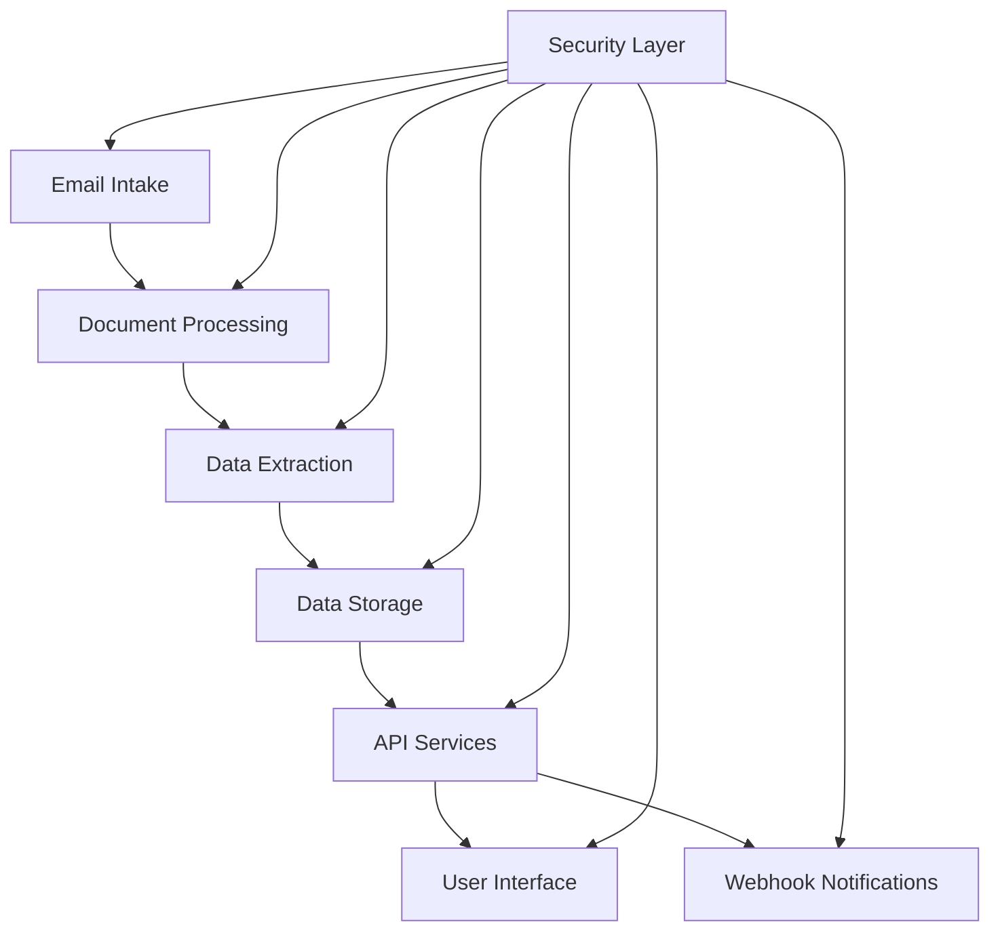

1. Email Intake
   - Automatically retrieves emails from submissions@dollarfunding.com
   - Extracts email metadata and attachments
   - Implemented using Python with IMAP/POP3 libraries

2. Document Processing
   - Classifies PDF attachments (ISO application, bank statements, voided cheques)
   - Stores documents securely in Google Cloud Storage
   - Utilizes Google Cloud Vision API for advanced OCR processing

3. Data Extraction
   - Extracts relevant information from processed documents
   - Handles imperfect scans and handwritten applications
   - Implemented using Python with custom OCR post-processing algorithms

4. Data Storage
   - Stores extracted data and application metadata in Google Cloud SQL (PostgreSQL)
   - Implements data encryption at rest and in transit
   - Ensures compliance with data protection regulations

5. API Services
   - Provides RESTful API endpoints for data retrieval and system management
   - Implements authentication and authorization using OAuth 2.0
   - Developed using Python with Flask or FastAPI framework

6. User Interface
   - Web-based dashboard for viewing and managing applications
   - Responsive design compatible with desktop and tablet devices
   - Developed using TypeScript, React, and Tailwind CSS

7. Webhook Notifications
   - Real-time notifications for application status updates
   - Customizable webhook endpoints for client integration
   - Implemented using Google Cloud Functions

8. Security Layer
   - Implements end-to-end encryption for data in transit
   - Utilizes Google Cloud Identity and Access Management (IAM) for access control
   - Ensures compliance with GDPR, CCPA, and other relevant regulations

Key Technologies:
- Frontend: TypeScript, React, Tailwind CSS
- Backend: Python
- Cloud Infrastructure: Google Cloud Platform (GCP)
- Database: Google Cloud SQL (PostgreSQL)
- Storage: Google Cloud Storage
- OCR: Google Cloud Vision API
- Authentication: Google Identity Platform

The system is designed to be scalable, secure, and highly available, capable of handling a 200% increase in current application volume without performance degradation. It integrates seamlessly with Dollar Funding's existing infrastructure while providing a modern, efficient solution for MCA application processing.

## SYSTEM ARCHITECTURE

### PROGRAMMING LANGUAGES

The following programming languages will be used in the development of the Merchant Cash Advance (MCA) application processing system:

1. Python
   - Primary backend language
   - Justification: Excellent for data processing, OCR integration, and API development. Rich ecosystem of libraries for financial data handling and machine learning.

2. TypeScript
   - Frontend development language
   - Justification: Provides static typing for improved code quality and developer productivity. Seamless integration with React.

3. SQL
   - Database query language
   - Justification: Used for interacting with Google Cloud SQL (PostgreSQL) for efficient data retrieval and manipulation.

4. HTML5/CSS3
   - Frontend markup and styling
   - Justification: Industry standard for web-based user interfaces. CSS3 will be primarily used through Tailwind CSS.

5. JavaScript
   - Client-side scripting
   - Justification: Essential for interactive frontend features and will be used alongside TypeScript.

| Language   | Primary Use Case           | Justification                                                |
|------------|----------------------------|--------------------------------------------------------------|
| Python     | Backend development        | Versatile, rich ecosystem, excellent for data processing     |
| TypeScript | Frontend development       | Static typing, improved maintainability, React integration   |
| SQL        | Database operations        | Efficient data retrieval and manipulation in Cloud SQL       |
| HTML5/CSS3 | UI structure and styling   | Industry standard, used with Tailwind CSS for rapid styling  |
| JavaScript | Client-side interactivity  | Essential for dynamic frontend features                      |

### HIGH-LEVEL ARCHITECTURE DIAGRAM

The following diagram provides an overview of the system's components and their interactions:

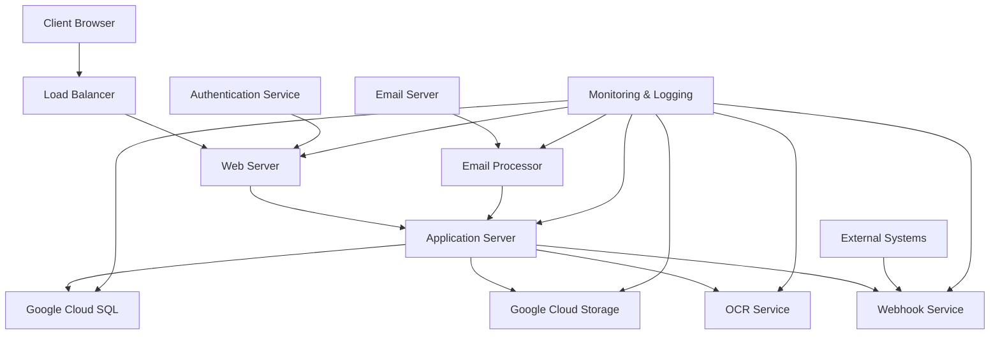

### COMPONENT DIAGRAMS

The following diagram details the specific components within the system and their relationships:

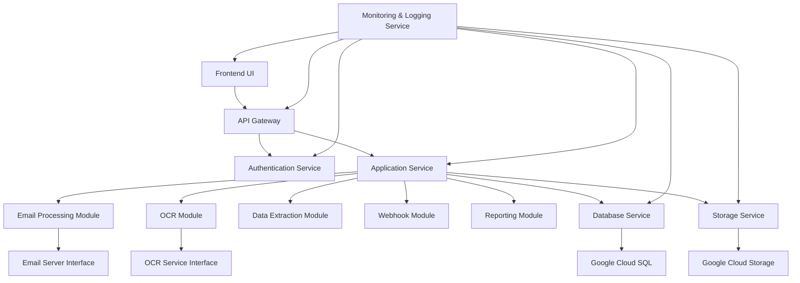

### SEQUENCE DIAGRAMS

1. Application Submission and Processing

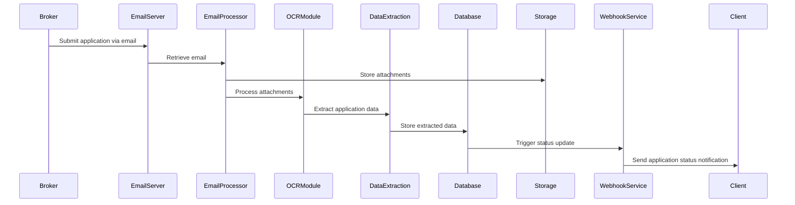

2. User Accessing Application Data

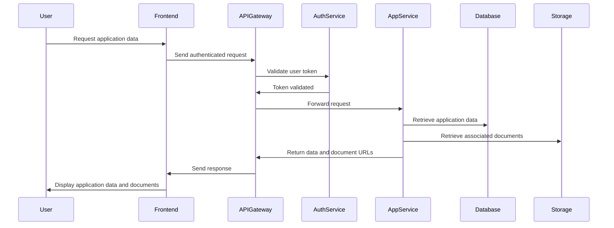

### DATA-FLOW DIAGRAM

The following diagram illustrates how information moves through the MCA application processing system:

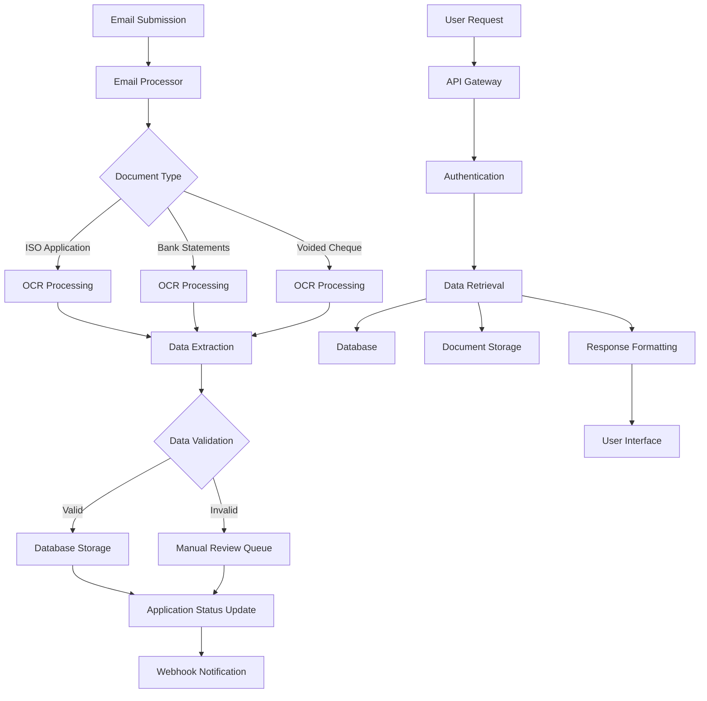

This data flow diagram demonstrates the movement of information from the initial email submission through various processing stages, including OCR, data extraction, validation, storage, and eventual presentation to users through the API and user interface. It also shows the flow for manual review of invalid or incomplete applications and the webhook notification system for real-time updates.

## SYSTEM DESIGN

### PROGRAMMING LANGUAGES

The following programming languages will be used in the development of the Merchant Cash Advance (MCA) application processing system:

| Language   | Primary Use Case           | Justification                                                |
|------------|----------------------------|--------------------------------------------------------------|
| Python     | Backend development        | Excellent for data processing, OCR integration, and API development. Rich ecosystem of libraries for financial data handling and machine learning. |
| TypeScript | Frontend development       | Provides static typing for improved code quality and developer productivity. Seamless integration with React. |
| SQL        | Database queries           | Efficient for complex data retrieval and manipulation in Google Cloud SQL (PostgreSQL). |
| HTML5/CSS3 | Frontend markup and styling | Industry standard for web-based user interfaces. CSS3 will be primarily used through Tailwind CSS. |

Additional languages and technologies:

- JavaScript: Used alongside TypeScript for certain client-side scripting needs.
- YAML/JSON: For configuration files and data exchange formats.

### DATABASE DESIGN

The system will use Google Cloud SQL with PostgreSQL as the primary relational database. Here's a high-level schema design:

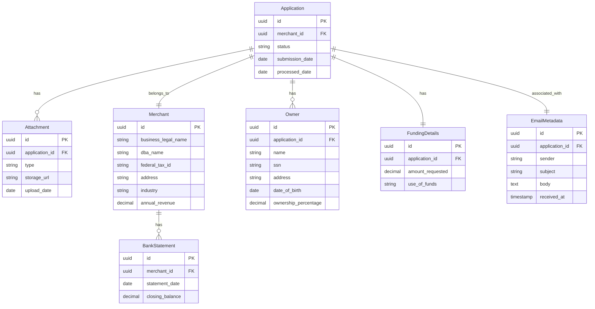

### API DESIGN

The system will expose a RESTful API for communication between the frontend and backend, as well as for integration with external systems. Here's an overview of the main API endpoints:

1. Applications

```
GET    /api/applications
POST   /api/applications
GET    /api/applications/{id}
PUT    /api/applications/{id}
DELETE /api/applications/{id}
```

2. Merchants

```
GET    /api/merchants
POST   /api/merchants
GET    /api/merchants/{id}
PUT    /api/merchants/{id}
DELETE /api/merchants/{id}
```

3. Attachments

```
GET    /api/attachments
POST   /api/attachments
GET    /api/attachments/{id}
DELETE /api/attachments/{id}
```

4. Webhooks

```
GET    /api/webhooks
POST   /api/webhooks
GET    /api/webhooks/{id}
PUT    /api/webhooks/{id}
DELETE /api/webhooks/{id}
```

5. OCR Processing

```
POST   /api/ocr/process
GET    /api/ocr/status/{job_id}
```

All API endpoints will:
- Use JSON for request and response bodies
- Implement proper HTTP status codes
- Include authentication using OAuth 2.0
- Implement rate limiting to prevent abuse
- Include comprehensive error handling and logging

### USER INTERFACE DESIGN

The user interface will be developed using React with TypeScript and styled using Tailwind CSS. The design will focus on responsiveness, accessibility, and user experience. Here's an overview of the main components:

1. Dashboard
   - Overview of recent applications
   - Key performance indicators
   - Quick action buttons

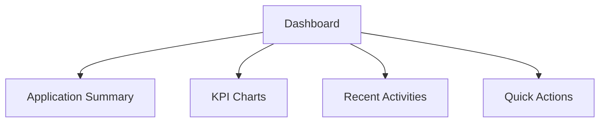

2. Application List
   - Sortable and filterable table of applications
   - Status indicators
   - Pagination controls

3. Application Detail View
   - Comprehensive display of application data
   - Document viewer for attachments
   - Processing history and status updates

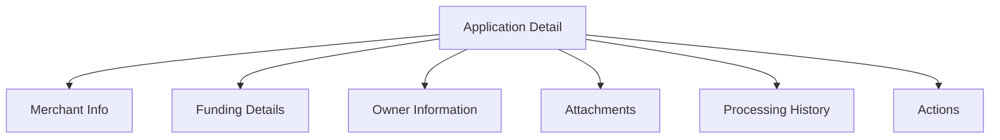

4. Webhook Management
   - List of registered webhooks
   - Form for adding/editing webhooks
   - Testing interface

5. User Management (Admin only)
   - User list with role assignments
   - Add/Edit user form

6. Settings
   - System configuration options
   - API key management
   - Notification preferences

The UI will implement:
- Responsive design principles for desktop and tablet compatibility
- WCAG 2.1 Level AA accessibility standards
- Dark mode support
- Skeleton loading states for improved perceived performance
- Toast notifications for system alerts and confirmations

By leveraging React, TypeScript, and Tailwind CSS, we can create a modern, maintainable, and efficient user interface that aligns with Dollar Funding's requirements for the MCA application processing system.

## TECHNOLOGY STACK

### PROGRAMMING LANGUAGES

The following programming languages will be used in the development of the Merchant Cash Advance (MCA) application processing system:

| Language   | Primary Use Case           | Justification                                                |
|------------|----------------------------|--------------------------------------------------------------|
| Python     | Backend development        | Excellent for data processing, OCR integration, and API development. Rich ecosystem of libraries for financial data handling and machine learning. |
| TypeScript | Frontend development       | Provides static typing for improved code quality and developer productivity. Seamless integration with React. |
| SQL        | Database queries           | Efficient for complex data retrieval and manipulation in Google Cloud SQL (PostgreSQL). |
| HTML5/CSS3 | Frontend markup and styling | Industry standard for web-based user interfaces. CSS3 will be primarily used through Tailwind CSS. |

Additional languages and technologies:
- JavaScript: Used alongside TypeScript for certain client-side scripting needs.
- YAML/JSON: For configuration files and data exchange formats.

### FRAMEWORKS AND LIBRARIES

The following frameworks and libraries will be utilized in the development process:

1. Backend (Python):
   - FastAPI: High-performance web framework for building APIs
   - SQLAlchemy: SQL toolkit and Object-Relational Mapping (ORM) library
   - Pydantic: Data validation and settings management using Python type annotations
   - Celery: Distributed task queue for handling background jobs
   - Pytest: Testing framework for Python code

2. Frontend (TypeScript/JavaScript):
   - React: JavaScript library for building user interfaces
   - React Router: Declarative routing for React applications
   - Redux Toolkit: State management library for React applications
   - Axios: Promise-based HTTP client for making API requests
   - Jest: JavaScript testing framework

3. UI Styling:
   - Tailwind CSS: Utility-first CSS framework for rapid UI development
   - Headless UI: Unstyled, accessible UI components for React

4. Documentation:
   - Swagger/OpenAPI: For API documentation
   - Storybook: For documenting and testing UI components

### DATABASES

The following database systems will be employed:

1. Primary Database:
   - Google Cloud SQL (PostgreSQL): Relational database for storing structured application data, user information, and system metadata.

2. Caching Layer:
   - Redis: In-memory data structure store for caching and improving read performance.

3. Document Storage:
   - Google Cloud Storage: Object storage for PDFs and other unstructured data.

### THIRD-PARTY SERVICES

The following external services and APIs will be integrated into the system:

1. Google Cloud Platform Services:
   - Google Cloud Vision API: For OCR processing of PDF documents
   - Google Cloud Pub/Sub: For handling real-time events and notifications
   - Google Cloud Functions: For serverless compute and webhook handling
   - Google Cloud Logging: For centralized logging and monitoring
   - Google Cloud Identity and Access Management (IAM): For access control and security

2. Email Services:
   - SendGrid: For sending transactional emails and notifications

3. Authentication:
   - Google Identity Platform: For user authentication and authorization

4. Monitoring and Error Tracking:
   - Google Cloud Monitoring (Stackdriver): For system monitoring and alerting
   - Sentry: For error tracking and performance monitoring

5. Content Delivery:
   - Google Cloud CDN: For delivering static assets and improving global performance

6. Security and Compliance:
   - Google Cloud Security Command Center: For security and risk management
   - Google Cloud Data Loss Prevention (DLP): For identifying and protecting sensitive data

7. Development and Deployment:
   - GitHub: For version control and code collaboration
   - GitHub Actions: For continuous integration and deployment (CI/CD)
   - Docker: For containerization of application components

8. Testing:
   - Postman: For API testing and documentation
   - Cypress: For end-to-end testing of the web application

This technology stack leverages the power of Python for backend development, TypeScript and React for frontend development, and the Google Cloud ecosystem for infrastructure and services. It provides a robust, scalable, and secure foundation for building the Merchant Cash Advance application processing system while maintaining consistency with the previously outlined requirements and specifications.

## SECURITY CONSIDERATIONS

### AUTHENTICATION AND AUTHORIZATION

The MCA application processing system will implement a robust authentication and authorization mechanism to ensure secure access to the system and its resources.

1. Authentication:
   - Implement OAuth 2.0 using Google Identity Platform for user authentication
   - Enforce multi-factor authentication (MFA) for all user accounts
   - Use JSON Web Tokens (JWT) for maintaining authenticated sessions

2. Authorization:
   - Implement Role-Based Access Control (RBAC) with the following roles:
     - Administrator
     - Data Entry Specialist
     - Auditor
     - API Consumer
   - Use Google Cloud Identity and Access Management (IAM) for fine-grained access control to GCP resources

| Role                | Permissions |
|---------------------|-------------|
| Administrator       | Full system access, user management, configuration |
| Data Entry Specialist | View and process applications, limited data editing |
| Auditor             | Read-only access to applications and system logs |
| API Consumer        | Limited API access based on OAuth 2.0 scopes |

3. API Security:
   - Implement API key authentication for external integrations
   - Use OAuth 2.0 client credentials flow for server-to-server API requests
   - Implement rate limiting to prevent abuse

4. Frontend Security:
   - Implement Cross-Site Request Forgery (CSRF) protection
   - Use HttpOnly and Secure flags for session cookies
   - Implement Content Security Policy (CSP) headers

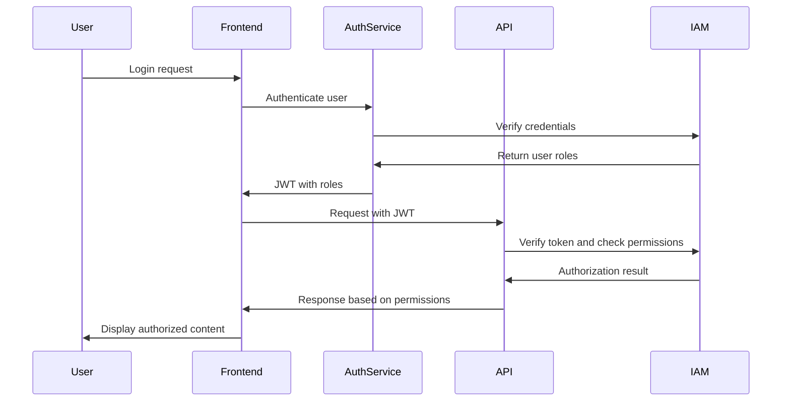

### DATA SECURITY

To protect sensitive information throughout the MCA application processing system, the following measures will be implemented:

1. Encryption:
   - Use AES-256 encryption for data at rest in Google Cloud SQL and Google Cloud Storage
   - Implement TLS 1.3 for all data in transit
   - Use Google Cloud Key Management Service (KMS) for key management

2. Data Classification:
   - Implement a data classification system to categorize information based on sensitivity
   - Apply appropriate security controls based on data classification

| Classification | Examples | Security Controls |
|----------------|----------|-------------------|
| Public | Marketing materials | No special controls |
| Internal | Employee emails | Access control, encryption in transit |
| Confidential | Customer PII, financial data | Encryption at rest and in transit, access logging |
| Restricted | Encryption keys, authentication tokens | Strict access control, encryption, audit logging |

3. Data Masking and Anonymization:
   - Implement data masking for sensitive fields (e.g., SSN, Tax ID) in logs and non-production environments
   - Use data anonymization techniques for testing and development environments

4. Secure File Handling:
   - Implement virus scanning for all uploaded files using Google Cloud Security Command Center
   - Use signed URLs with expiration for temporary file access

5. Database Security:
   - Enable Google Cloud SQL audit logging
   - Implement database connection pooling with encrypted connections
   - Use parameterized queries to prevent SQL injection attacks

6. Secure Coding Practices:
   - Implement input validation and sanitization for all user inputs
   - Use secure coding guidelines for Python backend development
   - Implement regular security code reviews and static code analysis

### SECURITY PROTOCOLS

The following security protocols and standards will be implemented to maintain system security:

1. Network Security:
   - Use Google Cloud VPC for network isolation
   - Implement firewall rules to restrict access to resources
   - Use Cloud Identity-Aware Proxy (IAP) for secure access to admin interfaces

2. Monitoring and Logging:
   - Implement centralized logging using Google Cloud Logging
   - Use Google Cloud Monitoring for real-time system monitoring and alerting
   - Implement log analysis for security event detection

3. Incident Response:
   - Develop and maintain an incident response plan
   - Conduct regular incident response drills
   - Implement automated alerting for security incidents

4. Vulnerability Management:
   - Conduct regular vulnerability scans using Google Cloud Security Scanner
   - Implement a patch management process for timely security updates
   - Perform annual penetration testing by a third-party security firm

5. Compliance:
   - Ensure compliance with PCI DSS for handling financial information
   - Implement GDPR and CCPA compliance measures for data protection
   - Adhere to NIST Cybersecurity Framework guidelines

6. Security Awareness:
   - Conduct regular security awareness training for all system users
   - Implement a security policy and ensure all employees acknowledge it

7. Third-party Security:
   - Implement a vendor risk assessment process
   - Ensure all third-party integrations adhere to security standards

8. Secure Development Lifecycle:
   - Implement security requirements gathering in the planning phase
   - Conduct threat modeling during the design phase
   - Perform security testing as part of the CI/CD pipeline

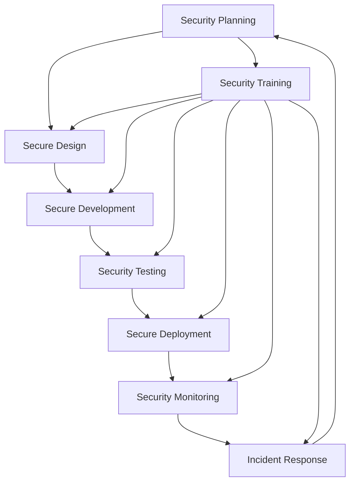

By implementing these security considerations, the MCA application processing system will maintain a strong security posture, protecting sensitive financial information and ensuring compliance with relevant regulations. Regular security assessments and updates to these protocols will be necessary to address evolving threats and maintain system security.